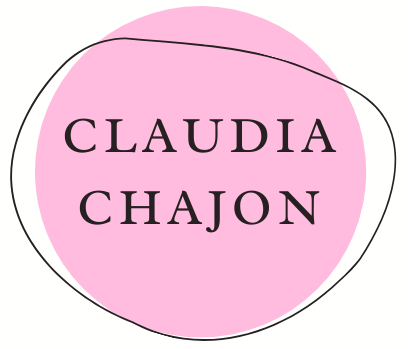
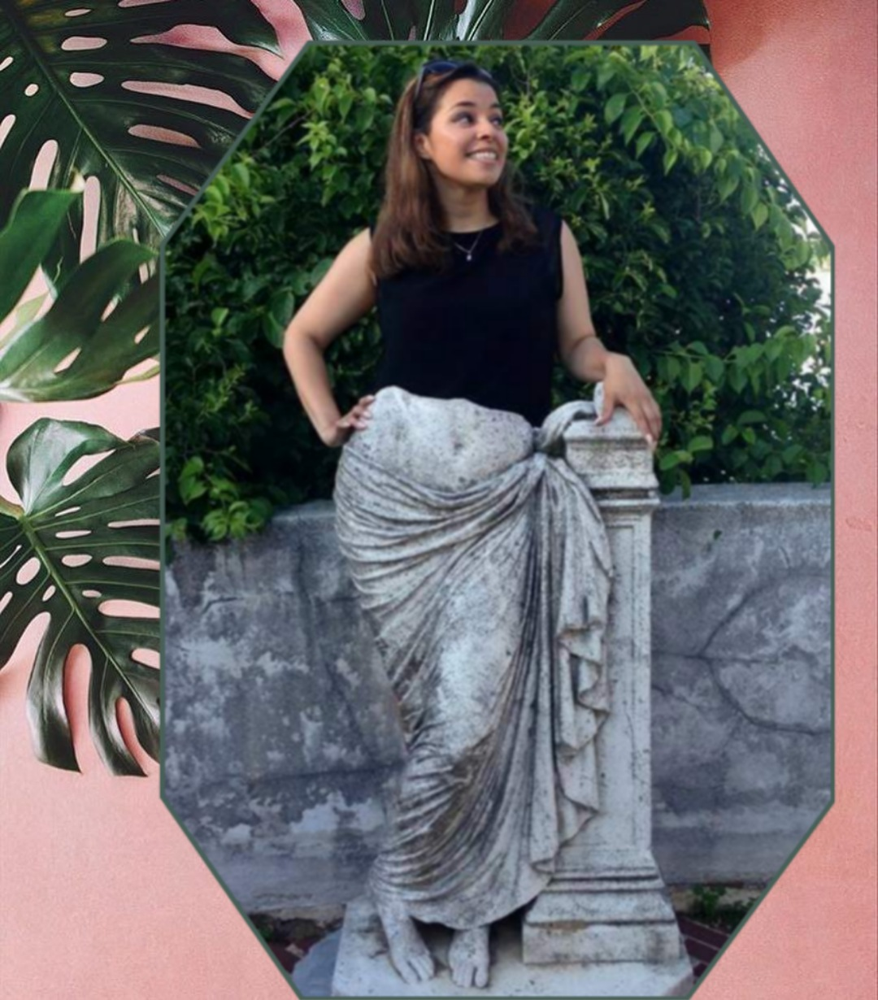

{: .align-center}

Hi, I am a Junior Data Scientist, I recently completed my studies at Lambda School. The experience at Lambda School has 
been both incredibly tough and equally as rewarding.

I find data science and machine learning genuinely intriguing, the many applications of data science coupled with my 
passion for knowledge have led me down several rabbit holes of study. Which is a good problem that I find myself facing 
quite a bit. I have a wide range of interests that include but are not limited to: crochet, housing 50+ plants in my 
apartment, learning German, rowing, fiber art, cult films and baking.

I love films and storytelling, I am passionate about how data visualization 
allows a data scientist different methods and tools in order to tell a story using data.
{: .align-center}

{: .align-center}
